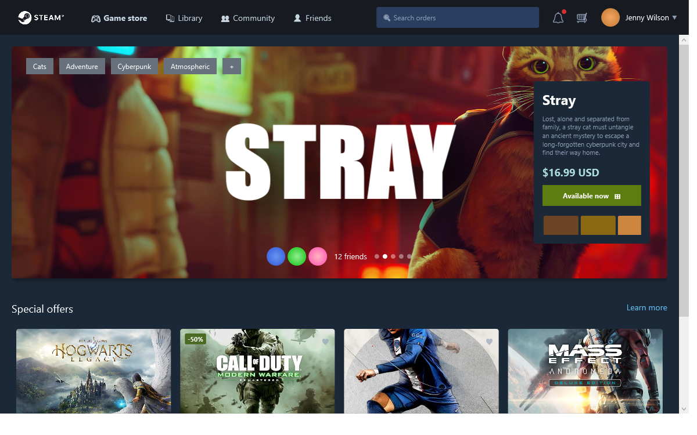
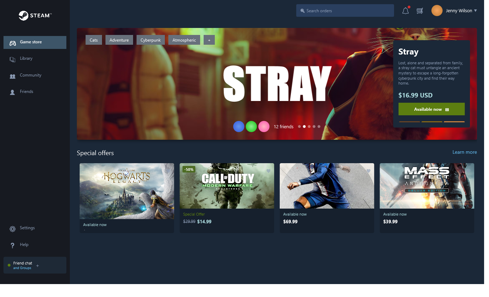
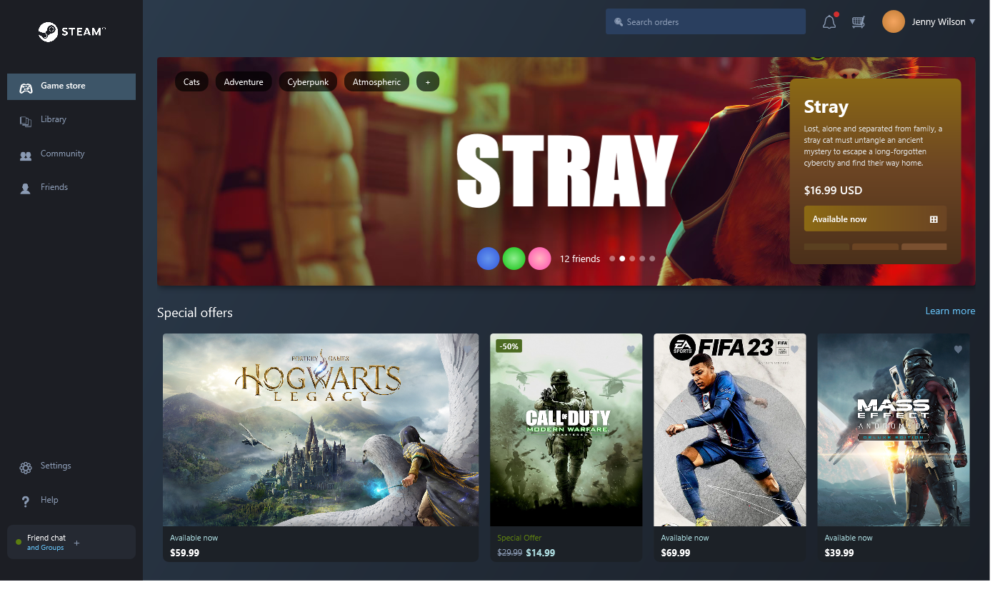
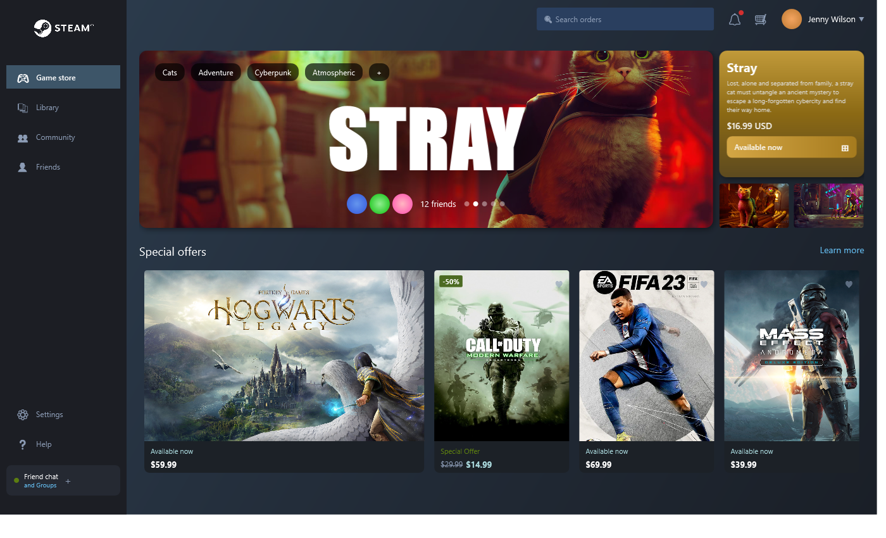
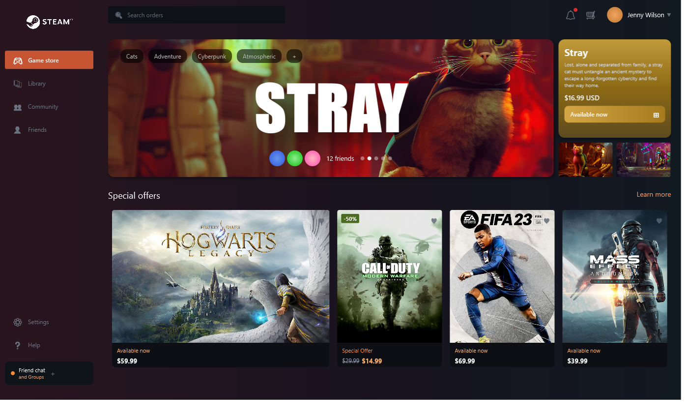

# vibe-wpf

A WPF application demonstrating rapid UI development and iteration using live inspection capabilities. This project showcases a Steam Store mockup interface built with WPF and .NET.

## About

This is a sample project exploring the "vibe code inner loop" - a development workflow that leverages `dotnet watch` and automated screenshots for rapid UI iteration. The application demonstrates how to build rich desktop interfaces with WPF while maintaining fast feedback cycles during development.

The UI design is based on the [Steam Desktop App Redesign](https://dribbble.com/shots/20659983-Steam-Desktop-App-Redesign) by [Juxtopposed](https://dribbble.com/Juxtopposed) on Dribbble.

## Features

- **Live Inspection**: HTTP server exposing UI screenshots and visual tree
- **Hot Reload**: Automatic rebuild and restart on file changes via `dotnet watch`
- **Rapid Iteration**: PowerShell script for automated UI capture and app control
- **Modern WPF UI**: Demonstrates gradients, rounded corners, image brushes, and responsive layouts

## Development Workflow with Copilot

This project demonstrates rapid UI iteration using GitHub Copilot and automated visual feedback. Here's how the Steam Store mockup evolved through iterative development:

### Iteration 1: Initial Layout

*Starting with basic structure and layout*

### Iteration 2: Adding Content

*Integrating game images and refining the grid structure*

### Iteration 3: Design Refinement

*Adjusting proportions and styling to match the design reference*

### Iteration 4: More Polish

*Fine-tuning content sizing and layout proportions*

### Iteration 5: Color Refinement

*Adjusting color scheme to match the design reference*

The workflow combines:

1. Natural language requests to Copilot ("make the featured card wider")
2. Automatic code generation and file updates
3. Instant visual feedback via `.\get-vibe.ps1 ui`
4. Quick iteration cycles until the design matches expectations

## Attribution

### Design

- Original Steam Store Redesign by [Juxtopposed](https://dribbble.com/Juxtopposed)
- Design Source: [Steam Desktop App Redesign on Dribbble](https://dribbble.com/shots/20659983-Steam-Desktop-App-Redesign)

### Trademarks

All game titles, logos, and brand imagery are property of their respective owners. See [Images/README.md](MyWpfApp/Images/README.md) for detailed trademark attributions.

### Technologies

- WPF (Windows Presentation Foundation)
- .NET 10.0
- VibeExtensions (HTTP server for live inspection)
